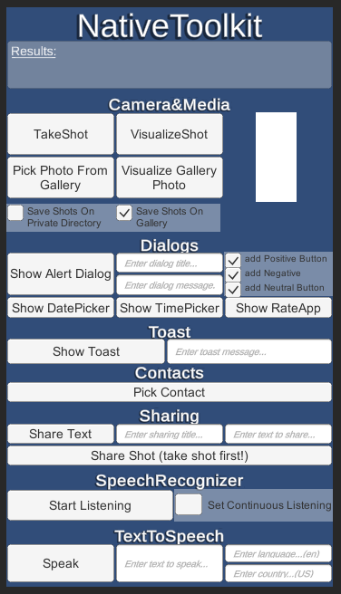

# UnityAndroidNativeToolkit 🧰
*Created by Eric Batlle Clavero*
 
This **Android App** made with **Unity** includes a complete **AndroidToolkit plugin** to allow Unity to **use native Android OS** features such as taking shots with the camera, pop dialogs, pick contacts, etc..

This repository is divided in 2 parts:

- Unity Project (**C#**)
- Android Plugin (**Java**)

## Example 🎬

  

*This image shows all UnityAndroidNativeToolkit features UI.*

## Donations are appreciated! 💸
*Remember that are many ways to say thank you.*

If this plugin has been helpful remember to star the repository and consider buying me a coffee! 😀 

If you like my general work and contributions consider [sponsoring me on Github](https://github.com/sponsors/EricBatlle). 

But if you just want to donate straightforward, I also have [PayPal.me](https://paypal.me/EricBatlleClavero?locale.x=es_ES).

## How to Use ⚙️

If you want to test the app, you can download the APK from [here](https://github.com/EricBatlle/UnityAndroidNativeToolkit/releases/download/v1.0/UnityNativeToolkit_1.0.apk).

If you want to open the project and check the code, you need to have **Unity** and **AndroidStudio** installed and updated.

If you want to scratch the code:

- To check **Unity** project, **open the project**, select **NativeToolkit** scene.
Either inside the unity project or simply dragging the **.cs** classes on your editor, you have to watch on to the classes located on ``UnityAndroidNativeToolkit/Assets/Scripts``. 
- To check **Android Plugin** you can do it opening the solution with **AndroidStudio** and checking the classes located in ``UnityNativeToolkitPlugin_Android\NativeToolkit\src\main\java\com\eric\nativetoolkit``.

App Functionality is simple, just press the feature button you want to test. Some features like Dialogs also have toggles to specify some parameters.

On code side, the only thing to keep in mind is to make a Script (like ``NativeToolkit.cs`` in the example) that have a reference to ``NativeToolkitPlugin`` and initialize the plugin doing: ``pluginReferenceVariable = NativeToolkitPlugin.GetPlatformPluginVersion(this.gameObject.name);``

From here you can call all plugin features simply calling ``pluginReferenceVariable.`` and the feature you want, like ``pluginReferenceVariable.TakeShot()``.

If you don't want to implement all features callbacks, remember to only implement the desired feature interface, like ``INativeCamera``, instead of ``INativeToolkitPlugin``. This last one implements all features interfaces.

## Features 🧰

- **Camera&Media**
	- Take and Visualize Shots with device camera
	- Save those shots into gallery or private directory
	- Pick and Visualize photos from gallery
- **Dialogs**
	- Show Alert Dialog
	- Show Date picker Dialog
	- Show Time picker Dialog
	- Show Rate app Dialog
	- Select how many buttons (positive, negative and neutral) appear on dialogs
- **Toast**
	- Show Toast message
	- Customize duration and position of the toast
- **Contacts**
	- Pick Contact
- **Sharing**
	- Share Text
	- Share Image
- **SpeechRecognizer**
	- Recognize voice commands
	- Recognize voice commands continuously
- **TextToSpeech (TTS)**
	- Speak text
	- Select language and country for the speaking voice

## Multiple plugins support 🔌

This plugin has been made following a **fragment-pattern** to avoid errors that can be derived from extending *UnityPlayerActivity*.

This way you can integrate this plugin with your projects even if they already have more plugins. **Truly pluggable**.

If you already have imported on your project the library ``core-1.3.1.aar`` or similar, remember to remove it, or remove the plugin one.

## Upgrading dependencies 📜

Keep in mind that the actual release ([v1.0](https://github.com/EricBatlle/UnityAndroidNativeToolkit/releases/download/v1.0/UnityNativeToolkit_1.0.apk)) of the plugin works with **AndroidX** dependencies. That means that is targeting **Android 9** (API level 28).
